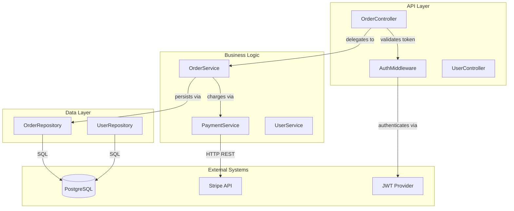
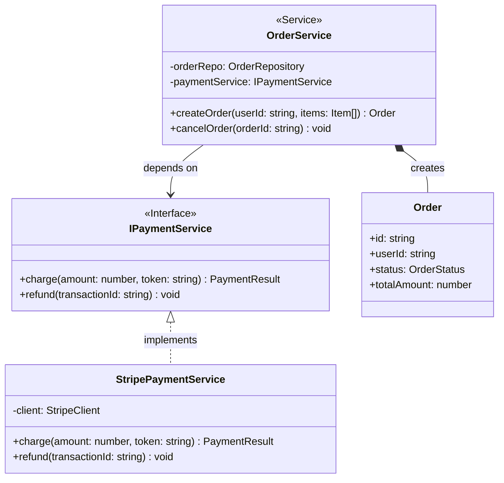

  

CodeFlowMap is an Agentic Codebase walk through Agent - Parse through the large codebase and create C4 Architecture diagrams based on the Source grounded information - though backed by AI.  The system is designed with Treesitter and powerful parsing mechanisms and guardrails to keep the outcomes legit and truthful.

We have two modes of implementation right now.

### VS Code Custom Agent

A VS Code Custom Agent that integrates directly into your editor. Point it at your workspace and get architecture diagrams without leaving the IDE.

→ [Read the VS Code README](./vscode/README.md)

### DeepAgent CLI Tool

A CLI deep-agent that runs an autonomous multi-step analysis loop using [LangChain DeepAgents](https://docs.langchain.com/oss/python/deepagents/). Point it at any local repo, approve the plan, and receive a fully generated `codeflowmap.md` file.

→ [Read the DeepAgent README](./deepagent/README.md)

### Samples

