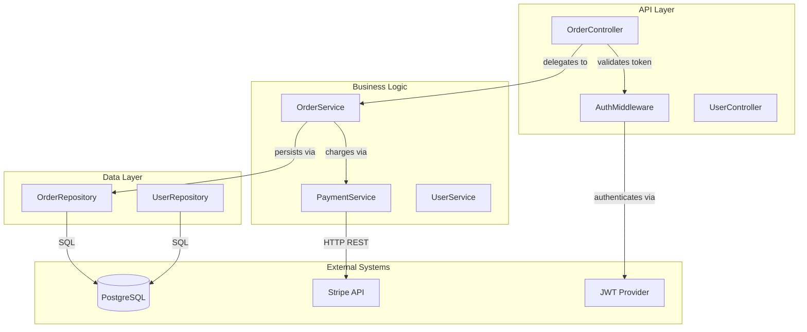
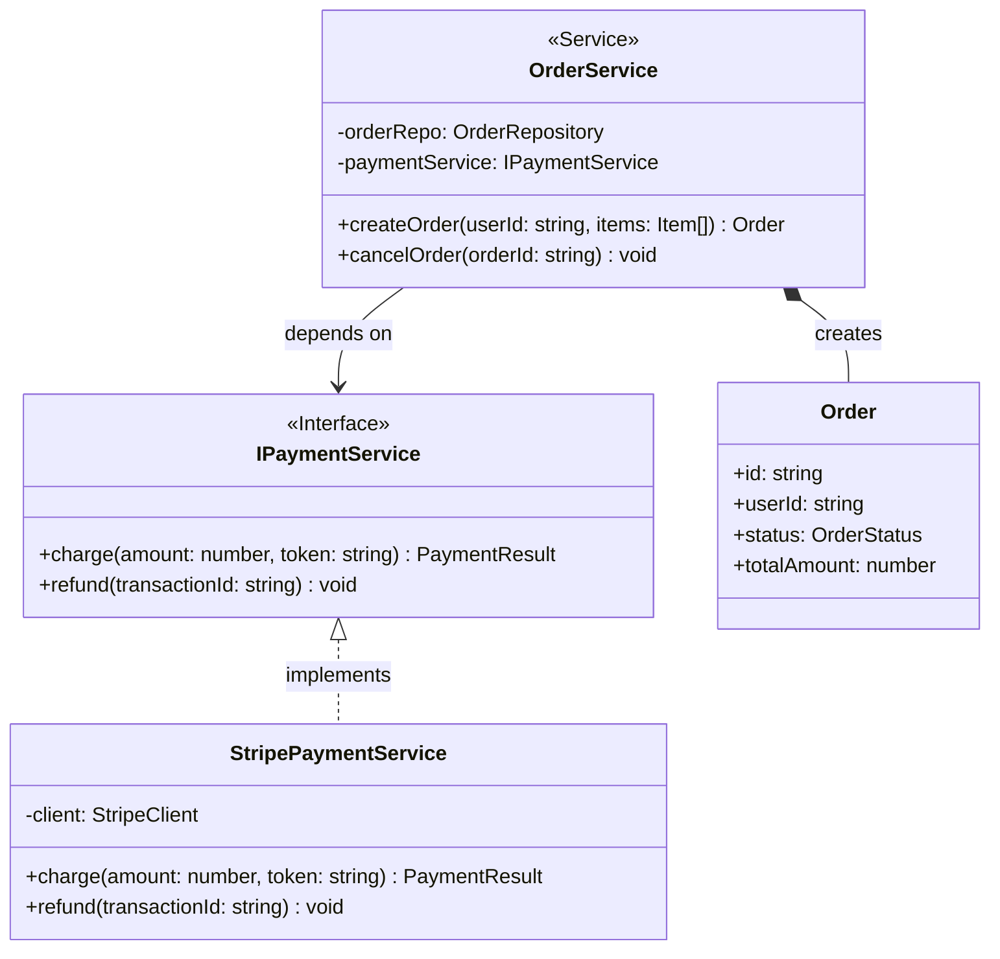

# CodeFlowMap

> A VS Code Custom Agent that reads your codebase like a Senior Staff Engineer and maps it into detailed C4-style Mermaid diagrams — at both component and class level.

## What is CodeFlowMap?

CodeFlowMap is a **VS Code Custom Agent** powered by GitHub Copilot that analyzes any codebase and automatically generates two levels of architectural diagrams in [Mermaid](https://mermaid.js.org/) syntax:

- **Component Diagram** — C4 Level 3: how your system's runtime components connect and communicate
- **Class Diagram** — C4 Level 4: how your classes, interfaces, and types relate to each other

No manual diagramming. No outdated architecture docs. Just point CodeFlowMap at your codebase and get a clear, navigable map — instantly.


## Why CodeFlowMap?

Every team has that moment:
- A new engineer joins and spends days just figuring out the structure
- A tech lead tries to explain the architecture on a whiteboard from memory
- A PR review stalls because no one is sure how two modules are connected

CodeFlowMap solves this by treating your code as the single source of truth and producing diagrams that actually reflect what's in the repo — not what someone *thought* was there six months ago.


## Features

- **Entry-point aware** — starts from `main()`, server bootstraps, CLI handlers, or exported API surfaces and traces outward
- **Layer detection** — identifies controllers, services, repositories, adapters, domain models, and infrastructure automatically
- **C4-aligned output** — component and class diagrams follow the [C4 model](https://c4model.com/) convention for clarity and consistency
- **Full relationship mapping** — inheritance, composition, aggregation, dependency injection, and interface realization
- **External system awareness** — surfaces databases, third-party APIs, message queues, and caches as first-class diagram nodes
- **Design pattern recognition** — annotates Repository, Factory, Singleton, Strategy, and other patterns with `<<stereotypes>>`
- **Architectural notes** — includes a Staff Engineer-level observations section after every diagram generation
- **Language agnostic** — works with any language or framework supported by VS Code's workspace indexing


## Installation

### Prerequisites

- [Visual Studio Code](https://code.visualstudio.com/) v1.100 or later
- [GitHub Copilot](https://github.com/features/copilot) subscription (Free, Pro, or Team)
- GitHub Copilot extension installed in VS Code

### Setup

1. **Clone or download** this repository

   ```bash
   git clone https://github.com/AKSarav/CodeFlowMap.git
   ```

2. **Copy the agent file** into your project or VS Code user profile:

   **Project-level** (available only in this workspace):
   ```
   your-project/
   └── .github/
       └── agents/
           └── codeflowmap.agent.md   ← paste agent file here
   ```

   **User-level** (available across all workspaces):
   Use the Command Palette:
   ```
   Cmd/Ctrl + Shift + P → Chat: New Custom Agent → User profile
   ```
   Paste the contents of `codeflowmap.agent.md` into the editor that opens.

3. **Reload VS Code** (or run `Developer: Reload Window` from the Command Palette)


## Usage

1. Open the **Chat view** in VS Code (`Ctrl+Alt+I` / `Cmd+Ctrl+I`)
2. Select **CodeFlowMap** from the agents dropdown at the top of the Chat panel
3. Type a prompt:

   ```
   Generate diagrams for this codebase
   ```

   Or scope it to a specific module:

   ```
   Generate diagrams for the /src/auth module
   ```

   Or ask for a specific focus:

   ```
   Map the component diagram for the payment flow only
   ```

4. CodeFlowMap will analyze the workspace, trace the architecture, and output:
   - A codebase summary
   - A Mermaid component diagram
   - A Mermaid class diagram
   - A set of architectural observations

5. **Render the diagrams** by copying the Mermaid code into:
   - [Mermaid Live Editor](https://mermaid.live)
   - A `.mmd` file with the [Mermaid VS Code extension](https://marketplace.visualstudio.com/items?itemName=bierner.markdown-mermaid)
   - Any Markdown file with Mermaid rendering (GitHub, Notion, Confluence, etc.)


## Example Output

### Codebase Summary

> A Node.js REST API using a layered architecture (Controller → Service → Repository). Built with Express and TypeScript, backed by PostgreSQL via TypeORM. Payment processing delegated to Stripe. Authentication handled via JWT middleware.

### Component Diagram



### Class Diagram




## Example Prompts

| What you want | Prompt |
|---|---|
| Full codebase map | `Generate component and class diagrams for this codebase` |
| Single module | `Map the /src/payments module only` |
| Focus on domain layer | `Generate a class diagram for the domain layer only` |
| Specific flow | `Trace the component flow for a user login request` |
| Expand a diagram | `Add the event flow for order processing to the component diagram` |
| Large monorepo | `Generate diagrams for the auth-service package only` |


## How It Works

CodeFlowMap follows a 4-step analysis protocol internally:

1. **Discover Entry Points** — finds `main()` functions, server bootstraps, route registrations, CLI entrypoints, and exported API surfaces
2. **Map Modules & Boundaries** — traverses the directory structure to identify layers, packages, and external dependencies
3. **Trace Class & Interface Structures** — enumerates classes, interfaces, types, and their relationships (inheritance, composition, injection)
4. **Follow Data & Control Flow** — traces how a request or event travels through the system end-to-end

It then produces both diagrams in a single pass with a structured output that's immediately pasteable into any Mermaid renderer.


## Tested and Works Best With

- Node.js / TypeScript projects
- Java / Spring Boot
- Python (FastAPI, Django, Flask)
- Go microservices
- .NET / C# applications
- Any well-structured project with clear module boundaries


## Contributing

Pull requests are welcome. If you find a codebase pattern that CodeFlowMap doesn't handle well, open an issue with a minimal reproduction case and the expected diagram output.

---

## License

MIT © [AKSarav](https://github.com/AKSarav)
